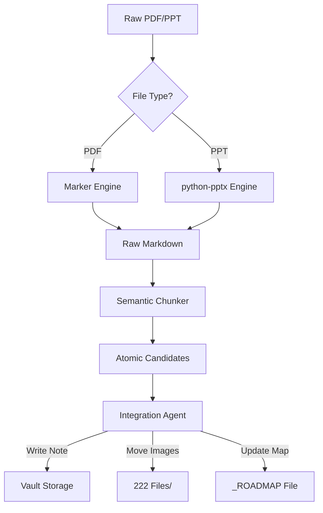

# Architecture Patterns

**Domain:** Obsidian Zettelkasten Automation
**Researched:** 2026-02-05

## Recommended Architecture

The system follows a **Linear Transformation Pipeline** pattern, processing documents from raw binary formats into interconnected Markdown nodes. It decouples *extraction* (getting text out) from *synthesis* (understanding text) to prevent context loss.

### System Diagram



### Component Boundaries

| Component | Responsibility | Communicates With |
|-----------|---------------|-------------------|
| **Ingestion Router** | Detects file type, validates path, routes to correct engine. | File System, Extraction Engines |
| **Extraction Engine** | Converts binary to "Flat Markdown" + extracted images. Preserves structure (headers/slides). | `Marker`, `python-pptx`, Asset Store |
| **Semantic Chunker** | Splits flat markdown into "Concept Blocks" using LLM or Heuristics (Header 2/Slide). | LLM API, Extraction Engine |
| **Integration Agent** | Generates final frontmatter, validates links, determines Roadmap placement. | LLM API, Vault File System |
| **Roadmap Manager** | Parses `_ROADMAP` files, inserts new links in correct hierarchy, preserves manual edits. | Vault File System, `python-frontmatter` |

### Data Flow

1.  **Ingest:** User drops file or runs command.
2.  **Extract:** 
    - PDF: Converted to Markdown. Images extracted to `./temp`.
    - PPT: Slides iterated. Speaker notes + Slide Text + Slide Screenshot combined into "Slide Block".
3.  **Asset Normalization:** Images moved to `222 Files/` with unique names. References in Markdown updated to `![[Image.png]]`.
4.  **Atomization:** 
    - "Flat Markdown" is sent to LLM with prompt: "Identify distinct concepts. Return list of atomic notes."
    - LLM returns structured JSON: `[{title, body, tags, related_concepts}]`.
5.  **Persist:** 
    - Check if Note exists. If yes, append/merge or skip.
    - Write `000 Zettelkasten/[Subject]/[Title].md`.
6.  **Roadmap Update:** 
    - Read `_ROADMAP [Subject].md`.
    - LLM determines: "Which section does [Title] belong to?"
    - Update list in Roadmap file.

## Patterns to Follow

### Pattern 1: The "Asset First" Write
**What:** Always move and rename images to `222 Files/` *before* generating the final Markdown note.
**Why:** Prevents broken links if the process fails halfway. The asset ID (filename) becomes the immutable reference.
**Example:**
```python
def handle_image(image_data, vault_root):
    hash_name = generate_hash(image_data)
    target_path = vault_root / "222 Files" / f"{hash_name}.png"
    if not target_path.exists():
        write_image(target_path, image_data)
    return f"![[{hash_name}.png]]"
```

### Pattern 2: The "Slide Context" Block
**What:** For PPTs, treat one slide as one "Context Block" initially. Do not split a single slide into multiple notes immediately unless they are clearly distinct definitions.
**When:** Processing Lecture Slides or Conference Talks.
**Why:** Slides often lack grammatical continuity. Splitting mid-slide destroys meaning.

### Pattern 3: Roadmap "Injection"
**What:** Treat the Roadmap file as a tree. Use an AST-like approach (or regex with context) to insert new links rather than appending to the bottom.
**When:** Updating `_ROADMAP [Subject].md`.
**Strategy:** Parse headers (`## Chapter 1`), find the list under it, append item, write back.

## Anti-Patterns to Avoid

### Anti-Pattern 1: "The PDF Dump"
**What:** converting a 50-page PDF into a single `Source - [Title].md` file.
**Why bad:** Defeats the purpose of Zettelkasten. Notes are too long to link effectively.
**Instead:** Create the Source note as a "Hub" (or MOC), but split the content into linked Atomic Notes.

### Anti-Pattern 2: "Blind LLM Linking"
**What:** Asking the LLM to "Add links to related notes" without providing the list of *existing* notes.
**Why bad:** Creates "Ghost Links" to notes that don't exist (`[[Cognitive Load Theory]]` vs `[[Cognitive Load]]`).
**Instead:** RAG (Retrieval Augmented Generation) approach—search existing vault headers, feed relevant ones to LLM, ask it to select from *that* list.

## Scalability Considerations

| Concern | At 100 Notes | At 10K Notes | At 100K Notes |
|---------|--------------|--------------|---------------|
| **Deduplication** | Simple string match on filenames. | Fuzzy search or Embedding similarity check. | Vector Database required. |
| **Roadmap Size** | Single file is fine. | Break Roadmap into sub-roadmaps (`_ROADMAP Calculus I`, `_ROADMAP Calculus II`). | Multi-level Indexing. |
| **Asset Folder** | Flat folder ok. | Flat folder gets slow to open in OS. | Subfolders by Year/Month (`222 Files/2025/`). |

## Sources

- [Zettelkasten Method](https://zettelkasten.de/) - Principles of atomicity.
- [Marker Architecture](https://github.com/VikParuchuri/marker) - Layout analysis pipeline.
- [LangChain Document Loaders](https://python.langchain.com/docs/modules/data_connection/document_loaders/) - Patterns for chunking and splitting.