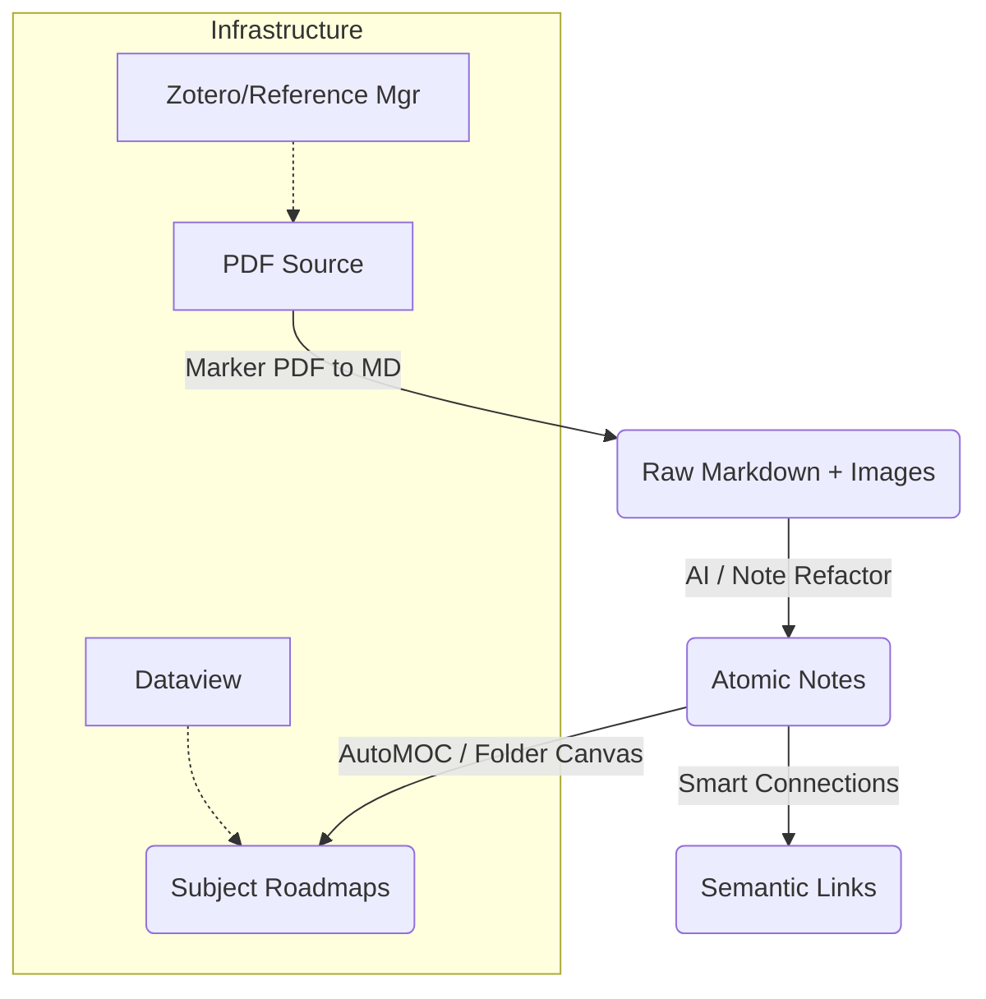

# Feature Landscape

**Domain:** Academic-to-Zettelkasten Automation
**Researched:** 2025-05-18

## Table Stakes

Features users expect in any functional Zettelkasten setup. Missing = manual drudgery.

| Feature | Why Expected | Complexity | Notes |
|---------|--------------|------------|-------|
| **PDF Text Extraction** | Foundation of processing. Users expect to read/highlight in Obsidian. | Low | Core Obsidian handles viewing; simple plugins handle text extraction. |
| **Reference Management** | Academic work requires citations. | High | Typically delegated to Zotero. Obsidian must link to it. |
| **Manual Atomic Splitting** | The core "Zettel" action. | Low | "Note Refactor" plugin is the standard baseline here. |
| **Backlinking** | The defining feature of networked thought. | Low | Native `[[wikilinks]]`. |
| **Dynamic Lists (Dataview)** | Automated "tables of contents" based on tags. | Medium | Dataview is essentially a required dependency for any serious vault. |
| **Image Assets Folder** | Images must live somewhere. | Low | Standard Obsidian behavior (attachments folder). |

## Differentiators

Features that upgrade a "digital filing cabinet" to an "automated knowledge engine".

| Feature | Value Proposition | Complexity | Notes |
|---------|-------------------|------------|-------|
| **AI Atomic Splitting** | Removes the friction of deciding "where to cut". Analyzes text and proposes atomic concepts. | High | Tools like **Atomizer** or **Note Companion** (File Organizer 2000). |
| **Visual Folder Roadmaps** | Auto-generates a "Map of Content" (Canvas) from a folder structure. Visualizes hierarchy instantly. | Medium | **Folder Canvas** plugin. Auto-updates when files change. |
| **Deep PDF Parsing** | Extracts **images**, tables, and formulas into Markdown, not just plain text. | High | **Marker PDF to MD**. Critical for academic slides/papers with diagrams. |
| **Semantic Linking** | AI suggests links based on *meaning*, not just exact keyword matches. | High | Various AI plugins (Smart Connections, etc.). |
| **Auto-Index Maintenance** | Keeps a "folder note" up to date with all children links automatically. | Low | **Zoottelkeeper** or **Waypoint**. Prevents "orphan notes". |

## Anti-Features

Common mistakes and patterns to explicitly avoid in automation.

| Anti-Feature | Why Avoid | What to Do Instead |
|--------------|-----------|-------------------|
| **Monolithic Conversions** | Dumping an entire 50-page PDF into one `.md` file makes it un-linkable and un-readable. | Split by header or use AI atomization. Keep source attached but not as the primary note body. |
| **Base64 Image Embedding** | Bloats file size, makes images un-reusable, breaks external editors. | Extract images to `assets/` or `222 Files/` and link via standard `![[image.png]]`. |
| **Over-Tagging** | Using tags for *everything* (topics, status, type) creates a messy graph. | Use **Properties** (Frontmatter) for status/type. Use **Links** for topics. |
| **PDF-Only Storage** | Keeping notes *inside* the PDF file (highlights only). Lock-in risk. | Extract highlights to Markdown immediately. The Note > The Source. |

## Feature Dependencies

## MVP Recommendation

For the "Obsidian Zettelkasten Automation" project, prioritize:

1.  **Deep Extraction Pipeline**: Implement **Marker PDF to MD** to ensure images/tables are preserved (Critical for academic PPTs).
2.  **Visual Roadmap Generator**: Integrate **Folder Canvas** to auto-generate the "Subject Roadmaps" mentioned in the milestone.
3.  **Atomic Assistant**: Configure **Note Refactor** (safe baseline) or prototype an AI splitter (high value differentiator).

**Defer:**
- Full Semantic Search/Chat (High complexity, distinct from "workflow automation").
- Bidirectional Zotero Sync (Stick to "Import" for now).

## Sources

- **Marker PDF to MD**: Best for image/table extraction [Obsidian Forum](https://forum.obsidian.md/t/marker-pdf-to-markdown-converter/78912) (High Confidence)
- **Folder Canvas**: For auto-updating visual roadmaps [GitHub](https://github.com/Developer-Mike/obsidian-folder-canvas) (Medium Confidence)
- **Atomizer/Note Companion**: For AI splitting [Obsidian Plugins](https://obsidian.md/plugins) (High Confidence)
- **Zoottelkeeper/Waypoint**: For MOC maintenance [Obsidian Plugins](https://obsidian.md/plugins) (High Confidence)